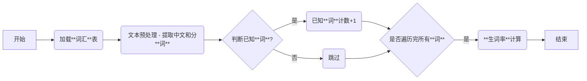

# 生词与生词率

**1. 引言**

本文档旨在详细解释中文学习平台项目中的核心概念：**生词**和**生词率**，以确保团队成员在开发过程中对这些概念有清晰、统一的理解。由于生词率直接影响用户学习体验和故事生成质量，因此务必保证其计算的准确性。

**2. 核心定义**

在中文学习平台项目中，我们使用以下核心定义：

- **词 (Word)**
  - **定义**: 词是由一个或多个汉字组成的具有完整语义的语言单位，例如 "你好"、"朋友"、"学习"、"火车站" 等。
  - **注意**: 词是最小的语言单位。
- **词性 (Part of Speech)**
  - **定义**: 词在特定语境下的语法分类， 例如： 名词 (noun), 动词 (verb), 形容词 (adjective), 副词 (adverb) 等。
  - **意义**: 词的词性标注有助于理解句子结构和词的具体含义。例如，“火车站”是名词。
  - **常用词性**: 常用的词性包括：
    - `n`：名词 (noun), 表示人或事物的名称，如 "苹果", "学校", "老师"。
    - `v`：动词 (verb), 表示动作或者状态，如 "跑", "吃", "是"。
    - `adj`：形容词 (adjective), 表示事物的性质或者状态，如 "好", "坏", "大"。
    - `adv`：副词 (adverb), 修饰动词，形容词或者其他副词，如 "很", "非常", "快"。
    - `PRON`：代词 (pronoun)， 代替名词或者名词性的短语, 例如 "你", "我", "他"。
    - `t`: 时间词 (temporal noun), 表示时间, 例如: "今天"，"早上"。
- **超童级别 (Chaotong Level)**
  - **定义**: 本项目中使用的自定义词汇等级，用于表示词汇的难度。 例如 1-100 的整数， 数字越小，难度越低。
  - **注意**: 每个词汇都有一个对应的超童级别，例如，级别 1 的词汇比级别 10 的词汇更简单。
- **已知词 (Known Word)**
  - **定义**: 如果一个词的 `chaotong_level` **小于**目标级别，则该词为已知词。**已知词不包含目标级别的词语。**
  - **核心要点**:
    - **基于 `chaotong_level`**: 已知词的判断基于词的 `chaotong_level` 是否小于目标级别。
  - **反向定义**:
    - **不是已知词**: 如果一个词的 `chaotong_level` 大于等于目标级别，则它不是已知词。
  - **正确示例**:
    - 如果目标级别为 10， 并且 `words.json` 文件中存在 "喜欢" (级别:5, 词性: v) 和 "跑步" (级别: 10, 词性: v) 的词汇，那么，对于文本 "我喜欢跑步"， "喜欢" 是已知词, "跑步" 不是已知词。
- **生词 (New Word)**
  - **定义**: 在指定目标级别**及其以下级别**中，所有词汇不包含的词，被认为是生词。
  - **反向定义**:
    - **不是生词**: 如果一个词出现在目标级别**及其以下级别**的词汇中，则它不是生词。
    - **如果一个词不在 `words.json` 中，则一定是生词。**
  - **注意**: **生词的判断会考虑词的词性 (part of speech)。** 如果 `words.json` 中存在 "白色/adj"，而文本中出现 "白色/adv"，则 "白色/adv" 是生词。
  - **正确示例**:
    - 如果目标级别为 10， 并且 `words.json` 文件中不存在 "游泳" 的词汇，那么对于文本 "我喜欢游泳"， “游泳” 是生词。
    - 如果目标级别为 10， 并且 `words.json` 文件中只存在 “白色/adj”， 那么对于文本 "白色/adj，白色/adv"， “白色/adv” 是生词。 因为 `words.json` 中没有 “白色/adv” 。
- **生词率 (New Word Rate)**
  - **定义**: 指文本中生词的數量与文本中所有词的數量的比率。
  - **关键点**:
    - **生词数量**: 文本中生词的个数。**同一个词在不同词性 (part of speech) 下，视为不同的词**。 例如：“白色/adj” 和 “白色/adv” 是不同的词。
    - **总词数**: 文本中所有词的个数， **不包含标点符号和非中文字符**。 **同一个词在不同词性下，视为不同的词**。
  - **计算公式**:
    - `生词率 = 生词数量 / 总词数`
    - `已知词率 = 已知词数 / 总词数`
    - `生词率 = 1 - 已知词率`
  - **注意**:
    - 生词率是一个相对的概念，它取决于目标级别。

**3. 生词率计算步骤**

生词率的计算步骤如下：

1.  **文本预处理**
    - **提取中文**: 使用正则表达式提取文本中的所有中文字符。**排除标点符号和非中文字符**。
    - **分词**: 将提取的中文文本进行分词，得到一个词的列表。
2.  **已知词汇加载**
    - 加载 `words.json` 文件中的所有词汇，并根据目标级别过滤出已知词汇，使用 `_load_known_words` 函数, 并存储已知词。
      - **`_load_known_words` 函数**: 加载**小于目标级别**的所有词汇，构建一个集合 (set), 包含所有已知**词和词的词性** 。
3.  **生词判断**
    - 遍历文本中的每一个词。
    - 如果该 **词和词的词性** 存在于已知词集合中，则该词是已知词。
    - 如果该 **词和词的词性** 不存在已知词集合中，则是生词。 **如果一个 词和词的词性 不在 `words.json` 中，则一定是生词。**
4.  **生词计数**: 统计文本中所有词的数量，以及已知词的个数。**同一个词在不同词性 (part of speech) 下，视为不同的词**。
5.  **生词率计算**: 使用以下公式计算生词率：
    - `生词率 = 生词数量 / 总词数`
    - `已知词率 = 已知词数 / 总词数`
    - `生词率 = 1 - 已知词率`

**4. 重点总结 (Lessons Learned)**

- **精确理解定义**: 务必清晰理解生词、已知词和生词率的定义，避免产生歧义。**当前版本的生词率计算只关注 词和词的词性 是否在已知词汇中出现。**
- **已知词的定义：** **已知词是指目标级别 _以下级别_ 中出现的 词和词的词性，不包括目标级别的词。**
- **`words.json` 的重要性**: **生词的判断依赖于 `words.json` 文件，如果一个 词和词的词性 不在 `words.json` 中，则一定是生词。**
- **简化实现**: 在当前阶段，生词率的计算只需要关注 词和词的词性 本身。
- **避免过度设计**: 在没有明确需求的情况下，不要过早地引入复杂的逻辑。
- **测试驱动开发**: 编写测试用例能够帮助我们尽早发现代码中的错误和理解上的偏差。
- **及时沟通**: 及时沟通和反馈可以帮助我们纠正理解上的偏差，确保对问题的看法一致。
- **代码实现必须严格遵循定义**: 代码实现必须与文档中的定义保持一致。

**5. 未来方向**

- 未来，如果需要添加更高级的词语处理（例如：考虑词的词性，同义词等），我们需要修改 `_load_known_words`， `_is_known_char` (需要修改为 `_is_known_word`) 和 `calculate_literacy_rate` (需要修改为 `calculate_vocabulary_rate`) 函数，并且修改测试用例。

**6. 最佳实践**

- **理解定义**: 务必理解生词、已知词和生词率的定义，避免产生歧义。
- **`words.json` 的重要性**: **生词的判断依赖于 `words.json` 文件，如果一个 词和词的词性 不在 `words.json` 中，则一定是生词。**
- **避免硬编码**: 不要在代码中硬编码任何级别值，应该从配置中读取。
- **添加日志**: 在关键步骤添加日志，方便调试。
- **异常处理**: 当 `words.json` 文件无法加载时，应该抛出异常并进行处理。
- **边界情况**: 当 `words.json` 为空时，所有的词都应该被认为是生词。

**7. 总结**

本文档详细阐述了中文学习平台项目中的生词和生词率的概念。通过正确理解这些概念，并严格按照文档中的定义和计算步骤实现代码，我们可以确保生词率计算的准确性，从而为用户提供更好的学习体验. **务必注意，生词率的计算依赖于 `words.json` 文件，如果一个 词和词的词性 不在 `words.json` 中，则一定是生词。**

### 3. 生词率检测流程图



### 4. 伪代码

```
function calculate_vocabulary_rate(text, target_level):
  known_words_dict = load_known_words(target_level)
  chinese_words = extract_chinese_words(text)  // 提取中文和分词
  total_chinese_words = length(chinese_words)
  known_words_count = 0

  for each word in chinese_words:
        if word in known_words_dict
            known_words_count = known_words_count + 1


  known_rate = known_words_count / total_chinese_words
  unknown_rate = 1 - known_rate
  return known_rate, unknown_rate
```

*   **`_load_known_words` 伪代码:**

    ```python
    def _load_known_words(words_json, target_level):
        # 1.  加载 words.json 文件
        # 2.  遍历 words_json 中的每一个词汇
        # 3.  如果词汇的 chaotong_level 小于 target_level
        # 4.  将词汇的 word 作为 key, 词性加入到 set 中， 作为 value。
        # 5.  返回 key 为词，value 为词性 set 的字典， 例如：  {"你好": {"PRON"}, "学习": {"v"}}
        pass
    ```
*    **`_is_known_word` 伪代码:**

    ```python
     def _is_known_word(word, pos, known_words_dict):
         # 1.  如果 word 不在 known_words_dict 的 key 中， 返回 False
        # 2.  如果 pos 在 known_words_dict[word] 的 value (set) 中， 返回 True
        # 3.  否则， 返回 False
        pass
    ```

