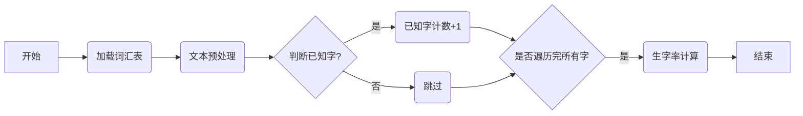

# 开发步骤

## 1. 概述

本文档旨在为中文学习平台的开发提供详细的步骤指导，确保开发过程高效、规范且正确。开发者应遵循以下步骤，并根据实际情况进行调整。

## 2. 开发前准备

### 2.1 环境配置

1.  **安装 Python 3.12**: 确保你的开发环境中安装了 Python 3.12 或更高版本。
2.  **安装依赖**: 使用 `pip` 安装项目所需的依赖包，例如 `Flask`, `pytest`, `requests`, `python-dotenv`等。可以使用 `pip install -r requirements.txt` 安装所有依赖包。
3. **配置虚拟环境**: 建议使用虚拟环境来管理项目依赖，避免不同项目之间的依赖冲突。例如使用 `venv`, 可以执行以下步骤创建和激活虚拟环境：
    ```bash
    python -m venv venv
    source venv/bin/activate  # On macOS and Linux
    # venv\Scripts\activate # On Windows
    ```
4.  **配置环境变量**: 创建 `.env` 文件，配置项目所需的敏感信息，例如 API Key、数据库连接信息等。
5.  **安装 Docker**:  安装 Docker 用于部署项目。

### 2.2 代码仓库

1.  **创建代码仓库**: 在 GitHub 或其他代码托管平台上创建项目代码仓库。
2.  **克隆代码仓库**: 将代码仓库克隆到本地开发环境。

### 2.3 项目结构

```
StroyPal/
├── app/                      # 应用程序代码
│   ├── __init__.py
│   ├── models/              # 数据模型
│   │   ├── __init__.py
│   │   ├── base_model.py
│   │   ├── word_model.py          # 字词模型
│   │   ├── scene_model.py          # 场景模型
│   │   └── story_model.py          # 故事模型
│   ├── services/           # 业务逻辑服务
│   │   ├── __init__.py
│   │   ├── word_service.py  # 字词服务
│   │   ├── scene_service.py # 场景服务
│   │   └── story_service.py # 故事服务
│   ├── utils/              # 工具函数
│   │   ├── __init__.py
│   │   ├── error_handling.py # 错误处理函数
│   │   ├── api_key_auth.py   # API Key 认证
│   │   ├── csv_import.py     # CSV 文件导入
│   │   └── config.py         # 项目配置
│   ├── api/                # API 路由
│   │   ├── __init__.py
│   │   ├── word_api.py       # 字词 API
│   │   ├── scene_api.py      # 场景 API
│   │   └── story_api.py      # 故事 API
│   └── config.py           # 项目配置
├── tests/                   # 测试代码
│   ├── __init__.py
│   ├── conftest.py
│   ├── models/              # 模型层测试
│   │   ├── test_word_model.py
│   │   ├── test_scene_model.py
│   │   └── test_story_model.py
│   ├── services/            # 服务层测试
│   │    ├── test_word_service.py
│   │    ├── test_scene_service.py
│   │    └── test_story_service.py
│   └── api/                  # API 层测试
│       ├── test_word_api.py
│       ├── test_scene_api.py
│       └── test_story_api.py
├── docs/                    # 项目文档
│   ├── api.md              # API 文档
│   ├── data_models.md       # 数据模型文档
│   ├── testing.md          # 测试策略文档
│   ├── error_codes.md        # 错误码文档
│   ├── development_steps.md # 开发步骤文档
│   └── prompt_engineering.md # 提示语工程文档
├── .env                     # 环境变量
├── requirements.txt         # 依赖列表
├── README.md                # 项目说明
├── docker-compose.yml      # Docker Compose 文件
└── Dockerfile               # Dockerfile 文件
```

## 3. 核心逻辑与算法

### 3.1 核心概念

1.  **字 (Character) 与 词 (Word)**：
    *   **字 (Character)**：汉字是中文的基本书写单位，例如 "我"、"你"、"好"。
    *   **词 (Word)**：词是由一个或多个汉字组成的具有完整语义的语言单位，例如 "你好"、"朋友"、"学习"。
    *   **明确区分**：在中文处理中，需要明确区分字和词的概念，因为它们在分词、词性标注以及生字率计算中扮演不同的角色。

2.  **词汇级别 (Vocabulary Level)**：
    *   **超童级别**：每个词汇都有一个对应的级别，例如 1 到 100，表示词汇的难度。
    *   **级别划分**：词汇级别可以基于 HSK 等标准，并进一步细分为 100 个超童级别。

3.  **生字率 (New Character Rate)**：
    *   **定义**：生字率指的是文本中 **不属于** 目标级别及其以下级别已知词汇的字的比例。
    *   **重要性**：生字率是衡量文本难度的一个关键指标，直接影响学习者的阅读体验和学习效果。

4.  **已知字 (Known Character) 和 生字 (New Character)**：
    *   **已知字**：在指定目标级别及其以下级别中，所有词汇包含的字，被认为是已知字。
    *   **生字**：在指定目标级别及其以下级别中，所有词汇不包含的字，被认为是生字。
    *   **词性影响**: 同一个字，如果在不同词性的词语中出现，如果词性的词语不在已知词汇中，那么这个字也属于生字。例如 “白” 字，在 “白色” 中是形容词，在“白说”中是动词，如果只知道“白色”，那么 “白说” 中的 “白” 属于生字。

### 3.2 核心算法：生字率计算

1.  **数据准备**：
    *   **词汇表加载**:  从 `word.json` 文件中加载所有词汇数据到内存，构建一个 `known_words_dict`。
    *   `known_words_dict` 的结构:
        *   Key 是字 (character)。
        *   Value 是一个集合 (set)， 包含该字在目标级别以下出现过的所有词性 (part of speech)。
        *   例如: `{"好": {"a", "ad"}, "人": {"n"}, "学": {"v"}}`
        *   只加载 `chaotong_level` 小于等于目标级别的词汇。

2.  **文本预处理**：
    *   **提取中文**: 使用正则表达式提取文本中的所有中文字符。
    *   **分词和词性标注**:  **可以使用** `jieba.posseg.cut` **进行分词和词性标注，但这不是唯一选择。开发者可以根据实际情况选择其他分词方法，或者自定义分词规则。**

3.  **生字率计算逻辑**：
    *   **遍历文本中的每个字符**：遍历文本中的每个字符 (character)，并获取其词性 (part of speech)。
    *   **判断已知字**：如果一个字 (character) 存在于 `known_words_dict` 的 keys 中，并且该字的词性 (part of speech) 也存在于该字对应的 `known_words_dict` 的 value 中，则认为该字是已知字。
    *   **生字计数**：统计文本中所有字的数量，以及已知字的个数。
    *   **生字率计算**：使用以下公式计算生字率和生字数量：
        *   **已知字率 = 已知字数 / 总字数**。 *其中，已知字数和总字数都不考虑去重，且不包含任何标点符号和非中文字符。*
        *   `生字率 = 1 - 已知字率`
        *   `生字数量 = 总字数 * 生字率`

### 3.3 生字率检测流程图



### 3.4 伪代码

```
function calculate_literacy_rate(text, target_level):
  known_words_dict = load_known_words(target_level)
  chinese_chars = extract_chinese_characters(text)
  total_chinese_words = length(chinese_chars)
  known_words_count = 0

  for each char in chinese_chars:
      char_pos =  get_char_and_pos(text, char)
      if char_pos not None:
            char_in_text, pos_in_text = char_pos
            if char_in_text in known_words_dict and pos_in_text in known_words_dict[char_in_text]
                  known_words_count = known_words_count + 1

  known_rate = known_words_count / total_chinese_words
  unknown_rate = 1 - known_rate
  return known_rate, unknown_rate
```

### 3.5 示例代码 (Python)

```python
import re
# import jieba  # 注释掉 jieba 的导入
# import jieba.posseg as pseg  # 注释掉 jieba.posseg 的导入

def calculate_literacy_rate(text, target_level, known_word_pos_dict):
  """
  计算指定级别已知字率和生字率。

  Args:
    text: 待分析的文本字符串。
    target_level: 目标级别 (整数)。
    known_word_pos_dict: 字典，key为字，value为词性集合(set), 例如 {"好": {"a", "ad"}, "人": {"n"}, "学": {"v"}}
  Returns:
    一个包含已知字率和生字率的元组 (known_rate, unknown_rate)。
  """

  chinese_chars = re.findall(r'[\u4e00-\u9fff]', text)
  total_chinese_words = len(chinese_chars)

  if total_chinese_words == 0:
    return (1, 0)

  known_words_count = 0

  # 使用 jieba.posseg.cut 进行分词和词性标注
  # seg_list = pseg.cut(text) # 注释掉使用 jieba 分词的代码

  # 模拟分词和词性标注， 假设已经完成
  text_word_pos = {}
  # 这部分代码需要根据实际情况调整
  start = 0
  for char in chinese_chars:
      # 这里需要根据实际选择的分词方法进行调整
      # text_word_pos[start] = (char, "n")  # 假设所有词都是名词
      start += 1
  
  # for word, flag in seg_list: # 注释掉使用 jieba 的循环
  #   for i in range(len(word)):
  #       text_word_pos[start] = (word[i], flag)
  #       start += 1


  for i in range(len(chinese_chars)):
    char = chinese_chars[i]
    char_pos = text_word_pos.get(i)
    if char_pos is not None:
      char_in_text, pos_in_text = char_pos

      # 如果字在已知字词典中，并且词性也在该字的已知词性集合中，则认为是已知字
      if known_word_pos_dict.get(char_in_text) and pos_in_text in known_word_pos_dict.get(char_in_text):
        known_words_count += 1

  known_rate = known_words_count / total_chinese_words
  unknown_rate = 1 - known_rate

  return (known_rate, unknown_rate)
```

## 4. 开发步骤

### 4.1 需求分析

1.  **熟悉文档**:  仔细阅读产品需求文档 (PRD) 和 API 设计指南，明确每个 API 的功能、输入参数、输出格式和错误处理逻辑。
2.  **理解数据模型**:  仔细阅读数据模型文档，理解数据结构，字段类型，和取值范围。
3.  **分解任务**: 将 PRD 中的需求分解为可执行的开发任务。
4.  **制定计划**:  根据任务的优先级，制定开发计划。

### 4.2 模型层开发

1.  **创建模型**: 在 `app/models` 目录下创建数据模型文件，例如 `word.py`、`scene.py` 和 `story.py`。
2.  **定义属性**:  根据 `docs/data_models.md` 定义数据模型的属性。
3.  **定义方法**: 定义数据模型的 CRUD 操作方法。
4.  **添加单元测试**:  在 `tests/models` 目录下创建单元测试，验证数据模型的正确性。

### 4.3 服务层开发

1.  **创建服务**: 在 `app/services` 目录下创建业务逻辑服务文件，例如 `word_service.py`、`scene_service.py` 和 `story_service.py`。
2.  **实现业务逻辑**: 在服务层实现业务逻辑，例如故事的生成、字词的查询、场景的管理。 **核心的生字率计算算法应该在这里实现， 可以参考 `3.2 核心算法：生字率计算`, `3.3 生字率检测流程图` `3.4 伪代码` 和 `3.5 示例代码`。**
3.  **调用模型层**:  服务层应调用模型层的方法来操作数据。
4.  **添加单元测试**: 在 `tests/services` 目录下创建单元测试，验证业务逻辑的正确性。

### 4.4 API 层开发

1.  **创建 API 路由**: 在 `app/api` 目录下创建 API 路由文件，例如 `word_api.py`、`scene_api.py` 和 `story_api.py`。
2.  **定义 API 接口**: 根据 `docs/api.md` 定义 API 接口的路由、请求方法、请求参数和响应格式。
    *   **API 框架细节**:
        *   使用 Flask Blueprints 来组织 API 路由。
        *   使用 `request` 对象获取请求参数。
        *   使用 `jsonify` 函数返回 JSON 响应。
        *   使用装饰器来处理 API 鉴权和错误处理。
3.  **调用服务层**:  API 层应调用服务层的方法来处理请求。
4.  **处理错误**:  使用 `app/utils/error_handling.py` 中提供的 `handle_error` 函数统一处理 API 的错误，确保错误码和错误信息与 API 设计指南一致。
5. **数据验证**: 在API 层， 需要对输入的数据进行验证，例如:  `vocabulary_level` 的取值范围， `new_char_rate` 的取值范围。可以使用 JSON Schema 进行验证， 确保数据类型和格式的正确性。
6.  **API 鉴权示例**:
    *  使用 `app/utils/api_key_auth.py` 中提供的 API Key 认证，并使用装饰器进行 API 鉴权。
    ```python
    from functools import wraps
    from flask import request, jsonify
    from app.utils.error_handling import handle_error

    def api_key_required(func):
        @wraps(func)
        def wrapper(*args, **kwargs):
            api_key = request.headers.get('Authorization')
            if not api_key or not api_key.startswith('Bearer '):
                return handle_error(4011, "API Key missing")
            api_key = api_key[7:] # Remove "Bearer " prefix
            if api_key != get_api_key_from_config(): # 假设这个函数从配置中读取 API Key
                return handle_error(4012, "Invalid API Key")
            return func(*args, **kwargs)
        return wrapper
    ```
    在 API 路由中使用 `@api_key_required` 装饰器。
    ```python
    from flask import Blueprint
    from app.utils.api_key_auth import api_key_required # 假设 api_key_required 函数在 app/utils/api_key_auth.py 中

    story_api = Blueprint('story_api', __name__, url_prefix='/v1/stories')

    @story_api.route('/generate', methods=['POST'])
    @api_key_required
    def generate_story():
        # API 代码
        pass
    ```
7.  **添加集成测试**:  在 `tests/api` 目录下创建集成测试，验证 API 接口的正确性。

### 3.5 错误处理

1.  **使用 `handle_error` 函数**:  在 API 层使用 `handle_error` 函数统一处理 API 的错误。
2.  **定义错误码**:  在 `docs/error_codes.md` 文件中定义错误码，确保错误码的清晰和准确。
3.  **添加详细的错误信息**:  确保 API 返回的错误信息清晰、具体，方便定位问题。

### 3.6 配置管理

1.  **配置 `config.py`**:  在 `app/config.py` 文件中定义项目配置，并使用 `python-dotenv` 加载 `.env` 文件中的环境变量。

    ```python
    # app/config.py
    import os
    from dotenv import load_dotenv

    load_dotenv()  # 加载 .env 文件

    class Config:
        # 获取 API Key
        API_KEY = os.getenv("API_KEY")
        DEEPSEEK_API_KEY = os.getenv("DEEPSEEK_API_KEY")
        # 如果是开发环境，可以设置 DEBUG = True
        DEBUG = os.getenv("DEBUG", False) == "True"
        # 配置其他
    def get_api_key_from_config():
        return Config.API_KEY
    ```
2.  **在代码中使用配置**:  使用 `app/config.py` 中的配置项。

    ```python
    from app.config import Config

    api_key = Config.API_KEY
    deepseek_key = Config.DEEPSEEK_API_KEY
    debug = Config.DEBUG
    ```

3.   **配置文件说明**:
    *   `.env` 文件存储敏感信息，例如 API Key, DeepSeek API Key。
    *   `config.py`  文件加载 `.env` 中的环境变量，并使用 `Config` 类来获取配置参数。

### 3.7 日志记录

1.  **配置 `logging`**:  使用 Python 的 `logging` 模块配置日志记录。
    ```python
    # app/__init__.py
    import logging
    logging.basicConfig(level=logging.DEBUG, format='%(asctime)s - %(levelname)s - %(message)s')
    ```
2.  **在代码中使用 `logging`**: 使用 `logging.info()`, `logging.error()`, `logging.debug()` 等函数记录日志。

    ```python
    import logging
    def generate_story():
        logging.info("Start generate story")
        try:
            # 代码逻辑
            logging.info("Story generated successfully")
            return
            except Exception as e:
            logging.error(f"Error while generating story {e}")
            raise e

    ```

### 3.8 单元测试

1.  **编写单元测试**:  为每个模块编写单元测试，确保代码的每个分支都被测试到。
    *  **测试驱动开发 (TDD)**： 鼓励开发人员使用测试驱动开发，先编写测试用例，再编写代码。
2.  **运行单元测试**:  使用 `pytest` 运行单元测试，确保测试通过。
3.  **提高代码覆盖率**:  努力提高单元测试的代码覆盖率，确保代码的健壮性。

### 3.9 集成测试

1.  **编写集成测试**:  为每个 API 接口编写集成测试，确保 API 接口的请求参数验证、业务逻辑处理和响应格式是否正确。
2.  **运行集成测试**: 使用测试客户端 (`Flask` 提供的 `test_client`) 来模拟 API 请求，确保测试通过。

### 3.10 代码审查

1.  **代码审查**:  在代码提交之前，进行代码审查，确保代码质量。
    *  **代码规范**: 遵循代码规范，例如 PEP 8。
    *   **命名规范**:
        *   **文件名**:  使用小写字母，单词之间使用下划线分隔，例如 `word_model.py`, `scene_service.py`。
        *   **变量名**: 使用小写字母，单词之间使用下划线分隔，例如 `user_id`, `api_key`。
        *   **函数名**:  使用小写字母，单词之间使用下划线分隔，例如 `get_user_info()`, `generate_story()`。
        *   **类名**:  使用驼峰命名法，例如 `WordModel`, `StoryService`。
        *  **常量**: 使用大写字母，单词之间使用下划线分隔，例如  `MAX_WORD_COUNT`, `DEFAULT_PAGE_SIZE`
2.  **修复缺陷**:  根据代码审查结果，修复代码中的缺陷。

### 3.11 持续集成

1.  **配置持续集成**:  将代码集成到持续集成平台（例如 GitHub Actions），每次提交代码都自动运行测试，确保代码质量。
2.  **及时修复问题**: 及时修复持续集成平台中发现的问题。
3. **持续集成示例**: 可以使用 GitHub Actions 来实现持续集成， 例如:
    ```yaml
    name: CI

    on:
      push:
        branches: [ "main" ]
      pull_request:
        branches: [ "main" ]

    jobs:
      build:
        runs-on: ubuntu-latest

        steps:
        - uses: actions/checkout@v3
        - name: Set up Python 3.12
          uses: actions/setup-python@v4
          with:
            python-version: "3.12"
        - name: Install dependencies
          run: |
            python -m pip install --upgrade pip
            pip install -r requirements.txt
        - name: Run tests
          run: |
            pytest
    ```

### 3.12  部署

1.  **构建 Docker 镜像**:  使用 Dockerfile 构建 Docker 镜像。
2.  **部署 Docker 容器**: 使用 `docker-compose.yml` 文件部署 Docker 容器。

## 4. 开发规范

*   **遵循代码规范**: 遵循代码规范，例如 PEP 8，确保代码的可读性。
*   **测试驱动开发 (TDD)**： 鼓励开发人员使用测试驱动开发，先编写测试用例，再编写代码。
*   **编写清晰的文档**: 编写清晰的 API 文档和用户手册，方便其他人使用 API。
*   **代码审查**:  在代码提交之前，进行代码审查，确保代码质量。
*  **使用版本控制**:  使用 Git 进行代码版本控制。

## 5. 开发中的注意事项

*   **保持代码简洁**:  尽量保持代码简洁易懂，避免使用过于复杂的结构或算法。
*   **及时沟通**:  在开发过程中，及时与团队成员沟通，解决开发中遇到的问题。
*   **及时更新文档**:  及时更新文档，确保文档与代码保持同步。
*   **注重代码质量**:  注重代码质量，确保代码的健壮性和可维护性。
*  **先测试后开发**: 编写单元测试之后再进行开发。


