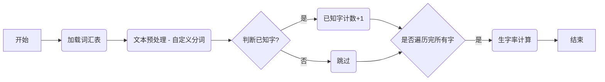

# 开发步骤

## 1. 概述

本文档旨在为中文学习平台的开发提供详细的步骤指导，确保开发过程高效、规范且正确。开发者应遵循以下步骤，并根据实际情况进行调整。

## 2. 开发前准备

### 2.1 环境配置

1.  **安装 Python 3.12**: 确保你的开发环境中安装了 Python 3.12 或更高版本。
2.  **安装依赖**: 使用 `pip` 安装项目所需的依赖包，例如 `Flask`, `pytest`, `requests`, `python-dotenv`, `Jinja2` 等。可以使用 `pip install -r requirements.txt` 安装所有依赖包。
3.  **配置虚拟环境**: 建议使用虚拟环境来管理项目依赖，避免不同项目之间的依赖冲突。例如使用 `venv`, 可以执行以下步骤创建和激活虚拟环境：

    ```bash
    python -m venv venv
    source venv/bin/activate  # On macOS and Linux
    # venv\Scripts\activate # On Windows
    ```
4.  **配置环境变量**: 创建 `.env` 文件，配置项目所需的敏感信息和可配置参数，例如 API Key、DeepSeek API Key、容差值等。具体请参考 `docs/config.md`。
5.  **安装 Docker**:  安装 Docker 用于部署项目。

### 2.2 代码仓库

1.  **创建代码仓库**: 在 GitHub 或其他代码托管平台上创建项目代码仓库。
2.  **克隆代码仓库**: 将代码仓库克隆到本地开发环境。

### 2.3 项目结构

```
StroyPal/
├── app/                      # 应用程序代码
│   ├── __init__.py
│   ├── models/              # 数据模型
│   │   ├── __init__.py
│   │   ├── base_model.py
│   │   ├── word_model.py          # 字词模型
│   │   ├── scene_model.py          # 场景模型
│   │   └── story_model.py          # 故事模型
│   ├── services/           # 业务逻辑服务
│   │   ├── __init__.py
│   │   ├── word_service.py  # 字词服务
│   │   ├── scene_service.py # 场景服务
│   │   └── story_service.py # 故事服务
│   ├── utils/              # 工具函数
│   │   ├── __init__.py
│   │   ├── error_handling.py # 错误处理函数
│   │   └── api_key_auth.py   # API Key 认证
│   ├── api/                # API 路由
│   │   ├── __init__.py
│   │   ├── word_api.py       # 字词 API
│   │   ├── scene_api.py      # 场景 API
│   │   └── story_api.py      # 故事 API
│   ├── config.py           # 项目配置
│   └── data/               # 测试数据
│       ├── words.json       # 字词数据
│       ├── scenes.json      # 场景数据
│       └── story.json       # 故事数据
├── tests/                   # 测试代码
│   ├── __init__.py
│   ├── conftest.py
│   ├── models/              # 模型层测试
│   │   ├── test_word_model.py
│   │   ├── test_scene_model.py
│   │   └── test_story_model.py
│   ├── services/            # 服务层测试
│   │    ├── test_word_service.py
│   │    ├── test_scene_service.py
│   │    └── test_story_service.py
│   └── api/                  # API 层测试
│       ├── test_word_api.py
│       ├── test_scene_api.py
│       └── test_story_api.py
├── docs/                    # 项目文档
│   ├── api.md              # API 文档
│   ├── data_models.md       # 数据模型文档
│   ├── testing.md          # 测试策略文档
│   ├── error_codes.md        # 错误码文档
│   ├── development_steps.md # 开发步骤文档
│   └── prompt_engineering.md # 提示语工程文档
├── .env                     # 环境变量
├── requirements.txt         # 依赖列表
├── README.md                # 项目说明
├── docker-compose.yml      # Docker Compose 文件
└── Dockerfile               # Dockerfile 文件
```

## 3. 核心逻辑与算法

### 3.1 核心概念

1.  **字 (Character) 与 词 (Word)**：
    *   **字 (Character)**：汉字是中文的基本书写单位，例如 "我"、"你"、"好"。
    *   **词 (Word)**：词是由一个或多个汉字组成的具有完整语义的语言单位，例如 "你好"、"朋友"、"学习"。
    *   **明确区分**：在中文处理中，需要明确区分字和词的概念，因为它们在分词、词性标注以及生字率计算中扮演不同的角色。

2.  **词汇级别 (Vocabulary Level)**：
    *   **超童级别**：每个词汇都有一个对应的级别，例如 1 到 100，表示词汇的难度。
    *   **级别划分**：词汇级别可以基于 HSK 等标准，并进一步细分为 100 个超童级别。

3.  **生字率 (New Character Rate)**：
    *   **定义**：生字率指的是文本中 **不属于** 目标级别及其以下级别已知词汇的字的比例。
    *   **重要性**：生字率是衡量文本难度的一个关键指标，直接影响学习者的阅读体验和学习效果。

4.  **已知字 (Known Character) 和 生字 (New Character)**：
    *   **已知字**：在指定目标级别及其以下级别中，所有词汇包含的字，被认为是已知字。需要考虑词性，如果一个字在该词性下，出现在目标级别以下的词汇中，则认为是已知字。
    *   **生字**：在指定目标级别及其以下级别中，所有词汇不包含的字，被认为是生字。 需要考虑词性，如果一个字在该词性下，没有出现在目标级别以下的词汇中，则认为是生字。 **如果一个字不在 `words.json` 文件中，则认为是生字。**
    *   **词性影响**: 同一个字，如果在不同词性的词语中出现，如果词性的词语不在已知词汇中，那么这个字也属于生字。例如 “白” 字，在 “白色” 中是形容词，在“白说”中是动词，如果只知道“白色”，那么 “白说” 中的 “白” 属于生字。

### 3.2 核心算法：生字率计算

1.  **数据准备**：
    *   **词汇表加载**:  从 `app/data/words.json` 文件中加载所有词汇数据到内存，构建一个 `words_dict` 和 `known_words_dict`。
    *    **`words_dict` 的结构**:
          * Key 是词 (word) 字符串。
          * Value 是一个  `WordModel` 对象。
    *   **`known_words_dict` 的结构**:
        *   Key 是字 (character)。
        *   Value 是一个集合 (set)， 包含该字在目标级别以下出现过的所有词性 (part of speech)。
        *   例如: `{"好": {"ADJ"}, "人": {"n"}, "学": {"v"}}`
        *   只加载 `chaotong_level` 小于等于目标级别的词汇。

2.  **文本预处理**：
    *   **提取中文**: 使用正则表达式提取文本中的所有中文字符。
    *   **自定义分词**:  使用自定义的分词逻辑，将文本分割成词语和字， 使用最长匹配算法， 优先匹配更长的词语， 如果没有匹配到， 则使用 `jieba` 分词进行处理，并进行词性转换。
          *   自定义分词逻辑：
            *    加载  `words.json`  中的所有词汇， 构建 `words_dict`。
            *  按词汇的长度从长到短进行排序，优先匹配最长的词汇。
            *    遍历文本， 如果存在匹配的词汇，则将词汇和词性进行切分。 如果不存在匹配的词汇，则使用 `jieba` 分词，并添加词性转换后的词性和字到结果列表中。 **如果 `words.json` 中没有该词汇，则使用 jieba 的词性标注。**

3.  **生字率计算逻辑**：
    *   **遍历文本中的每个字符**：遍历文本中的每个字符 (character)，并获取其词性 (part of speech)。
     *   **使用 `known_words_dict` 判断已知字**: 如果一个字 (character) 存在于 `known_words_dict` 的 keys 中， 并且 该字对应的词性 (part of speech)  也在  `known_words_dict` 的 value 中, 或者在 `words.json` 中的 `characters` 字段的 `part_of_speech` 中，则认为该字是已知字。
    *   **生字计数**：统计文本中所有字的数量，以及已知字的个数。
    *   **生字率计算**：使用以下公式计算生字率和生字数量：
        *   **已知字率 = 已知字数 / 总字数**。 *其中，已知字数和总字数都不考虑去重，且不包含任何标点符号和非中文字符。*
        *   `生字率 = 1 - 已知字率`
        *   `生字数量 = 总字数 * 生字率`

### 3.3 生字率检测流程图



### 3.4 伪代码

```
function calculate_literacy_rate(text, target_level):
  known_words_dict = load_known_words(target_level)
  chinese_chars = extract_chinese_characters(text)
  total_chinese_words = length(chinese_chars)
  known_words_count = 0

  text_word_pos = custom_segment(text)

  for each char in chinese_chars:
     char_pos = get_char_and_pos(text_word_pos, char)
     if char_pos not None:
          char_in_text, pos_in_text = char_pos
          if char_in_text in known_words_dict and pos_in_text in known_words_dict[char_in_text]
                 known_words_count = known_words_count + 1
           else:
                for word_model in words:
                    if word_model.chaotong_level <= target_level and char_in_text == word_model.word:
                        for char_data in word_model.characters:
                            if char_data["character"] == char_in_text and char_data["part_of_speech"] in known_word_pos_dict[char_in_text] :
                                  known_words_count = known_words_count + 1
                                  break
                        if is_known:
                           break


  known_rate = known_words_count / total_chinese_words
  unknown_rate = 1 - known_rate
  return known_rate, unknown_rate
```

### 3.5 示例代码 (Python)

```python
import re
import jieba
import jieba.posseg

JIEBA_POS_MAP = {
            'n': 'n',      # 名词
            'v': 'v',      # 动词
            'a': 'a',      # 形容词
            'd': 'd',      # 副词
            'p': 'PREP',    # 介词
            'c': 'CONJ',    # 连词
            'u': 'PART',   # 助词
            'm': 'NUM',      # 数词
            'q': 'MW',     # 量词
            'r': 'PR',    # 代词
            'f': 'f',      # 方位词
            's': 's',     # 处所词
            't': 't',      # 时间词
            'l': 'OTHER',  # 临时语素, 转换为 '其他'
            'x': 'x',  # 标点符号
            'PER': 'PER', # 人名
            'LOC': 'LOC', # 地名
            'ORG': 'ORG', # 机构名
            'ADJ': 'ADJ',
            'ADV': 'ADV',
            "PR": "PR",
            "NUM": "NUM",
            "MW": "MW",
            "PREP": "PREP",
             "CONJ": "CONJ",
            "PART": "PART",
            'eng': 'OTHER',   # 英文，转换为 '其他'
        }

def map_jieba_pos(jieba_pos):
    """
    将 jieba 词性转换为 words.json 中的词性
    """
    return JIEBA_POS_MAP.get(jieba_pos, "OTHER") # 如果不存在，默认设置为 '其他'

def _custom_segment(self, text):
    """
    自定义分词函数
    Args:
        text: 待分词的文本字符串
    Returns:
        一个列表， 包含分词后的结果， 例如  [('你好', 'v'), ('，', 'x'), ('我', 'r'), ('喜欢', 'v'), ('跑步', 'n'), ('。', 'x')]
    """
    words = list(self.word_service.words.values())
    words.sort(key=lambda word: len(word.word), reverse=True) # 按词语长度进行排序，从长到短

    result = []
    start = 0
    while start < len(text):
        matched = False
        for word_model in words:
            if text.startswith(word_model.word, start):
                result.append((word_model.word, word_model.part_of_speech))
                start += len(word_model.word)
                matched = True
                break
        if not matched: # 如果没有匹配的词，则使用 jieba 分词，并转换词性
            jieba_words = jieba.cut(text[start:])
            for jieba_word in jieba_words:
                if jieba_word.strip(): # 过滤掉空格
                    jieba_pos = jieba.posseg.cut(jieba_word)
                    for word, flag in jieba_pos:
                       result.append((word, map_jieba_pos(flag)))
            start += len(text[start:])
            matched = True  #  使用 jieba 之后，跳出当前的循环

    return result

def _calculate_literacy_rate(self, text, target_level):
    """
    计算指定级别已知字率和生字率。

    Args:
        text: 待分析的文本字符串。
        target_level: 目标级别 (整数)。
    Returns:
        一个包含已知字率和生字率的元组 (known_rate, unknown_rate)。
    """
    known_word_pos_dict = self._load_known_words(target_level)
    chinese_chars = re.findall(r"[\u4e00-\u9fff]", text)
    total_chinese_words = len(chinese_chars)

    if total_chinese_words == 0:
        return (1, 0)

    known_words_count = 0

    # 使用自定义分词
    seg_list = self._custom_segment(text)
    text_word_pos = {}
    start = 0
    for word, flag in seg_list:
         for i in range(len(word)):
             text_word_pos[start] = (word[i], flag)
             start += 1

    for i in range(len(chinese_chars)):
       char = chinese_chars[i]
       char_pos = text_word_pos.get(i)
       if char_pos is not None:
           char_in_text, pos_in_text = char_pos
           is_known = False
           if char_in_text in known_word_pos_dict:
              if pos_in_text in known_word_pos_dict[char_in_text]:
                   is_known = True
              else:
                   for word_model in self.word_service.words.values():
                       if word_model.chaotong_level <= target_level and char_in_text == word_model.word:
                            for char_data in word_model.characters:
                                if char_data["character"] == char_in_text and char_data["part_of_speech"] in known_word_pos_dict[char_in_text] :
                                    is_known = True
                                    break
                            if is_known:
                               break

           if is_known:
            known_words_count += 1

    known_rate = known_words_count / total_chinese_words
    unknown_rate = 1 - known_rate
    return (known_rate, unknown_rate)

def _load_known_words(self, target_level):
    """
    加载小于等于目标级别的所有词汇。
    Args:
        target_level: 目标级别 (整数)。
    Returns:
        一个字典，key为字，value为词性集合(set), 例如 {"好": {"a", "ad"}, "人": {"n"}, "学": {"v"}}
    """
    known_words_dict = {}
    for word_model in self.word_service.words.values():
        if word_model.chaotong_level <= target_level:
            for char_data in word_model.characters:
                char = char_data["character"]
                part_of_speech = char_data["part_of_speech"]
                if char not in known_words_dict:
                   known_words_dict[char] = set()
                known_words_dict[char].add(part_of_speech)
    return known_words_dict

def load_jieba_userdict(self):
    """
    加载自定义词典
    """
    for word_model in self.word_service.words.values():
      jieba.add_word(word_model.word, tag=map_jieba_pos(word_model.part_of_speech) )

```
### 3.6 多轮对话策略

1.  **第一轮对话 (初始提示语)**:
    *   使用 **初始提示语模板**，提供故事场景、目标词汇级别、字数范围、目标生字率、重点词汇等基本要求，并明确 AI 的角色和目标。
    *  明确要求 AI 返回 JSON 格式数据， 包括 `title`，`content`，和 `key_words`。
    *   不包含 `new_char_rate` 和 `new_char` 的要求，这些将在后续的验证阶段计算。 提示 AI 生成故事时，注意 `new_char_rate` 和 `new_char`。

2.  **第二轮对话 (提供已知词汇)**:
    *   根据 `vocabulary_level` 加载已知词汇列表。
    *   如果已知词汇数量过多，可以选择分批次提供，或者只提供一定数量的示例。
    *   使用 **提供已知词汇模板**，将已知词汇列表添加到第二轮提示语中。
     *  在第二轮提示语中，如果重点词汇在已知词汇中， 可以适当调整重点词汇列表，确保故事包含一些新的挑战。

3.  **第三轮对话 (如果需要)**:
     *   **如果第二轮仍然提供太多的已知词汇， 可以进一步分割，分多轮提供**
     *  **根据第二轮的反馈**， 调整提示语， 例如：“请你注意，上轮提供的已知词汇不是所有都要使用， 只是供你参考。”

4.  **最终指令**:
    *   在最后一轮，给 AI 一个最终指令: `"请你根据以上需求，编写故事。"`
5.  **DeepSeek API 的使用**:
    *   **上下文管理**: 使用 `messages` 列表来管理对话上下文，在每轮对话后，将 AI 的回复添加到 `messages` 列表中。
    *   **调用 API**:  使用 `client.chat.completions.create` 函数调用 DeepSeek API。
6.  **故事验证**:
    *   在最后一轮对话后，使用我们之前的验证逻辑（包括生字率验证、重点词汇验证和字数验证）验证 AI 生成的故事。
7.  **JSON 写入**:
    *   如果验证通过， 构建符合规范的 JSON 响应， 添加 `new_char_rate` 和 `new_char`。
    *  **多轮对话的流程使用状态机进行管理， 根据用户的反馈动态调整对话策略**
    *  **状态机:**  使用一个简单的状态枚举来表示对话状态，例如 `INIT`, `PROVIDE_KNOWN_WORDS`, `FINAL_INSTRUCTION`， `FAILED`。

        *   **状态转移逻辑：**
            1.  **`INIT` 状态**: 发送初始提示语模板。
            2. **`INIT` -> `PROVIDE_KNOWN_WORDS`**: 初始状态，发送初始提示语后，进入 `PROVIDE_KNOWN_WORDS` 状态。
            3.  **`PROVIDE_KNOWN_WORDS` 状态**:  根据 `vocabulary_level` 加载已知词汇，并添加到提示语中。
            4. **`PROVIDE_KNOWN_WORDS` -> `FINAL_INSTRUCTION`**: 提供已知词汇后，进入 `FINAL_INSTRUCTION` 状态。
            5.  **`FINAL_INSTRUCTION` 状态**:  发送最终指令，并等待 AI 生成故事。
            6.  **`FINAL_INSTRUCTION` -> `INIT`**: 如果故事生成后验证失败，回到 `INIT` 状态，重新生成故事。
            7.  **`FINAL_INSTRUCTION` -> `FAILED`**: 如果故事生成后，达到最大重试次数，进入 `FAILED` 状态。
        *   **多轮对话控制:** 使用一个 `messages` 列表来管理对话的上下文，每次发送提示语时，将之前的对话历史也发送给 AI。
        *  **用户反馈调整：** 在 `FINAL_INSTRUCTION` 状态收到 AI 的回复后，进行故事验证， 如果验证不通过， 重新回到 `INIT` 状态，重新生成故事。

## 4. 开发步骤

### 4.1 需求分析

1.  **熟悉文档**:  仔细阅读产品需求文档 (PRD) 和 API 设计指南，明确每个 API 的功能、输入参数、输出格式和错误处理逻辑。
2.  **理解数据模型**:  仔细阅读数据模型文档，理解数据结构，字段类型，和取值范围。
3.  **分解任务**: 将 PRD 中的需求分解为可执行的开发任务。
4.  **制定计划**:  根据任务的优先级，制定开发计划。

### 4.2 模型层开发

1.  **创建模型**: 在 `app/models` 目录下创建数据模型文件，例如 `word.py`、`scene.py` 和 `story.py`。
2.  **定义属性**:  根据 `docs/data_models.md` 定义数据模型的属性。
3.  **定义方法**: 定义数据模型的 CRUD 操作方法。
4.  **添加单元测试**:  在 `tests/models` 目录下创建单元测试，验证数据模型的正确性。

### 4.3 服务层开发

1.  **创建服务**: 在 `app/services` 目录下创建业务逻辑服务文件，例如 `word_service.py`、`scene_service.py` 和 `story_service.py`。
2.  **实现业务逻辑**: 在服务层实现业务逻辑，例如故事的生成、字词的查询、场景的管理。
    *    **自定义分词**:  使用  `_custom_segment` 函数实现自定义分词。
    *   **核心的生字率计算算法应该在这里实现， 可以参考 `3.2 核心算法：生字率计算`， `3.3 生字率检测流程图`, `3.4 伪代码` 和  `3.5 示例代码`。
    *   **修改  `_load_known_words` 方法**:  使用 `words.json`  中 `characters` 字段的词性。
    *  **实现通过 `key_word_ids` 从 `words.json` 中查找对应的 `word` 和相关信息 ( `pinyin`, `definition`, `example`)。**
        *    **多轮对话**:  实现多轮对话的逻辑， 根据 `prompt_engineering.md` 中定义的模板， 构建提示语。 **使用状态机管理对话流程，根据用户的反馈动态调整对话策略。**
            *   **状态机:**  使用一个简单的状态枚举来表示对话状态，例如 `INIT`, `PROVIDE_KNOWN_WORDS`, `FINAL_INSTRUCTION`, `FAILED`。
            *   **对话策略：**
                1.  **`INIT` 状态**: 发送初始提示语模板。
                2.  **`PROVIDE_KNOWN_WORDS` 状态**:  根据 `vocabulary_level` 加载已知词汇，并添加到提示语中。
                3.  **`FINAL_INSTRUCTION` 状态**:  发送最终指令，并等待 AI 生成故事。
                 4. **`INIT` -> `PROVIDE_KNOWN_WORDS`**: 初始状态，发送初始提示语后，进入 `PROVIDE_KNOWN_WORDS` 状态。
                5. **`PROVIDE_KNOWN_WORDS` -> `FINAL_INSTRUCTION`**: 提供已知词汇后，进入 `FINAL_INSTRUCTION` 状态。
                 6.  **`FINAL_INSTRUCTION` -> `INIT`**: 如果故事生成后验证失败，回到 `INIT` 状态，重新生成故事。
                7.  **`FINAL_INSTRUCTION` -> `FAILED`**: 如果故事生成后，达到最大重试次数，进入 `FAILED` 状态。
            * **多轮对话控制:** 使用一个 `messages` 列表来管理对话的上下文，每次发送提示语时，将之前的对话历史也发送给 AI。
            *  **用户反馈调整：** 在 `FINAL_INSTRUCTION` 状态收到 AI 的回复后，进行故事验证， 如果验证不通过， 重新回到 `INIT` 状态，重新生成故事。
       *   **验证**:  实现故事的验证逻辑，包括生字率验证、重点词汇验证和字数验证。 计算 `new_char_rate` 和 `new_char`。
3.  **调用模型层**:  服务层应调用模型层的方法来操作数据。
4.  **添加单元测试**: 在 `tests/services` 目录下创建单元测试，验证业务逻辑的正确性。

### 4.4 API 层开发

1.  **创建 API 路由**: 在 `app/api` 目录下创建 API 路由文件，例如 `word_api.py`、`scene_api.py` 和 `story_api.py`。
2.  **定义 API 接口**: 根据 `docs/api.md` 定义 API 接口的路由、请求方法、请求参数和响应格式。
    *   **API 框架细节**:
        *   使用 Flask Blueprints 来组织 API 路由。
        *   使用 `request` 对象获取请求参数。
        *   使用 `jsonify` 函数返回 JSON 响应。
        *   使用装饰器来处理 API 鉴权和错误处理。
    *   **故事生成 API**:
        *   **URL**: `/v1/stories/generate`
        *   **Method**: `POST`
        *   **请求参数**:  `vocabulary_level` (integer, 必填), `scene_id` (string, 必填), `story_word_count` (integer, 必填), `new_char_rate` (float, 必填), `key_word_ids` (array of string, 可选), `new_char_rate_tolerance` (float, 可选), `word_count_tolerance` (float, 可选),  `story_word_count_tolerance` (integer, 可选), `request_limit` (integer, 可选)。
        *  **响应**: 返回生成的 `story_id`， 以及其他故事详情。
    *   **字词查询 API**:
         *   **URL**: `/v1/words`
        *   **Method**: `GET`
        *   **请求参数**:  `level` (integer, 可选), `part_of_speech` (string, 可选), `page` (integer, 默认1, 可选), `page_size` (integer, 默认10, 可选)。
    *  **场景管理 API**:
          *   **创建场景**:
             *   **URL**: `/v1/scenes`
             *   **Method**: `POST`
             *   **请求参数**: `name` (string, 必填), `description` (string, 必填)。
          *   **获取场景**:
              *   **URL**: `/v1/scenes/{scene_id}`
              *   **Method**: `GET`
          *   **更新场景**:
                *   **URL**: `/v1/scenes/{scene_id}`
              *   **Method**: `PUT`
              *    **请求参数**: `name` (string, 必填), `description` (string, 必填)。
          *   **删除场景**:
                 *   **URL**: `/v1/scenes/{scene_id}`
              *   **Method**: `DELETE`
    * **故事升级/降级 API**:
           *   **URL**: `/v1/stories/{story_id}/adjust`
           *  **Method**: `POST`
           *  **请求参数**: `target_level` (integer, 必填)
           *  **注意**:  `key_words` 字段暂时不提供，返回空列表。
3.  **调用服务层**:  API 层应调用服务层的方法来处理请求。
4.  **处理错误**:  使用 `app/utils/error_handling.py` 中提供的 `handle_error` 函数统一处理 API 的错误，确保错误码和错误信息与 API 设计指南一致。
5.  **数据验证**: 在API 层， 需要对输入的数据进行验证，例如:  `vocabulary_level` 的取值范围， `new_char_rate` 的取值范围， 字数范围，以及 `NEW_CHAR_RATE_TOLERANCE`, `WORD_COUNT_TOLERANCE`, `REQUEST_LIMIT` 和 `STORY_WORD_COUNT_TOLERANCE` 的值，可以使用 JSON Schema 进行验证， 确保数据类型和格式的正确性。API 请求参数的优先级高于 `.env` 文件中的配置。 **在 API 层对 `NEW_CHAR_RATE_TOLERANCE`、`WORD_COUNT_TOLERANCE`、`REQUEST_LIMIT` 和 `STORY_WORD_COUNT_TOLERANCE` 进行类型验证**
6.  **API 鉴权示例**:
    *  使用 `app/utils/api_key_auth.py` 中提供的 API Key 认证，并使用装饰器进行 API 鉴权。
    ```python
    from functools import wraps
    from flask import request, jsonify
    from app.utils.error_handling import handle_error
    from app.config import get_api_key_from_config # 假设这个函数从配置中读取 API Key

    def api_key_required(func):
        @wraps(func)
        def wrapper(*args, **kwargs):
            api_key = request.headers.get('Authorization')
            if not api_key or not api_key.startswith('Bearer '):
                return handle_error(4011, "API Key missing")
            api_key = api_key[7:] # Remove "Bearer " prefix
            if api_key != get_api_key_from_config():
                return handle_error(4012, "Invalid API Key")
            return func(*args, **kwargs)
        return wrapper
    ```
    在 API 路由中使用 `@api_key_required` 装饰器。
    ```python
    from flask import Blueprint
    from app.utils.api_key_auth import api_key_required # 假设 api_key_required 函数在 app/utils/api_key_auth.py 中

    story_api = Blueprint('story_api', __name__, url_prefix='/v1/stories')

    @story_api.route('/generate', methods=['POST'])
    @api_key_required
    def generate_story():
        # API 代码
        pass
    ```
7.  **添加集成测试**:  在 `tests/api` 目录下创建集成测试，验证 API 接口的正确性。

### 4.5 错误处理

1.  **使用 `handle_error` 函数**:  在 API 层使用 `handle_error` 函数统一处理 API 的错误。
2.  **定义错误码**:  在 `docs/error_codes.md` 文件中定义错误码，确保错误码的清晰和准确。
3.  **添加详细的错误信息**:  确保 API 返回的错误信息清晰、具体，方便定位问题。

### 4.6 配置管理

1.  **配置 `config.py`**:  在 `app/config.py` 文件中定义项目配置，并使用 `python-dotenv` 加载 `.env` 文件中的环境变量。 **请参考 `docs/config.md` 文件，了解如何配置和使用**。
2.  **在代码中使用配置**:  使用 `app/config.py` 中的配置项。
3.  **配置文件说明**:
    *   `.env` 文件存储敏感信息，例如 API Key, DeepSeek API Key， 以及一些可配置的参数（生字率容差值，字数容差值, API 请求频率限制, 字数容差值）。
    *   `config.py`  文件加载 `.env` 中的环境变量，并使用 `Config` 类来获取配置参数。
    *   **重要**:  `NEW_CHAR_RATE_TOLERANCE`, `WORD_COUNT_TOLERANCE`, `REQUEST_LIMIT` 和 `STORY_WORD_COUNT_TOLERANCE` 的值也可以通过 API 请求参数动态设置， API 请求参数的优先级高于 `.env` 文件中的值。 详细信息请参考 `docs/config.md`
    *  **在 API 层需要对 `NEW_CHAR_RATE_TOLERANCE`、`WORD_COUNT_TOLERANCE`、`REQUEST_LIMIT` 和 `STORY_WORD_COUNT_TOLERANCE` 进行类型验证**

### 4.7 日志记录

1.  **配置 `logging`**:  使用 Python 的 `logging` 模块配置日志记录。

    ```python
    # app/__init__.py
    import logging

    logging.basicConfig(level=logging.DEBUG, format='%(asctime)s - %(levelname)s - %(message)s')
    ```
2.  **在代码中使用 `logging`**: 使用 `logging.info()`, `logging.error()`, `logging.debug()` 等函数记录日志。

    ```python
    import logging

    def generate_story():
        logging.info("Start generate story")
        try:
            # 代码逻辑
            logging.info("Story generated successfully")
            return
        except Exception as e:
            logging.python
    import logging

    def generate_story():
        logging.info("Start generate story")
        try:
            # 代码逻辑
            logging.info("Story generated successfully")
            return
        except Exception as e:
            logging.error(f"Error while generating story {e}")
            raise e
    ```

### 4.8 单元测试

1.  **编写单元测试**:  为每个模块编写单元测试，确保代码的每个分支都被测试到。
    *  **测试驱动开发 (TDD)**： 鼓励开发人员使用测试驱动开发，先编写测试用例，再编写代码。
2.   **单元测试应该重点测试核心代码**:  例如生字率计算，多轮对话的逻辑，API 鉴权， 和 API 参数验证。
3.  **运行单元测试**:  使用 `pytest` 运行单元测试，确保测试通过。
4. **生成测试覆盖率报告**: 使用 `pytest-cov` 插件生成测试覆盖率报告。
    *   安装 `pytest-cov`:

        ```bash
        pip install pytest-cov
        ```
    *   运行测试并生成报告：

        ```bash
         pytest --cov=app --cov-report term-missing
        ```
        *  `--cov=app`:  指定要测试的代码目录。
        *  `--cov-report term-missing`: 在终端显示测试覆盖率报告，并显示未覆盖的代码行。
5.  **提高代码覆盖率**:  努力提高单元测试的代码覆盖率，确保代码的健壮性.  **单元测试应该尽量覆盖核心代码**

### 4.9 集成测试

1.  **编写集成测试**:  为每个 API 接口编写集成测试，确保 API 接口的请求参数验证、业务逻辑处理和响应格式是否正确。
2.  **运行集成测试**: 使用测试客户端 (`Flask` 提供的 `test_client`) 来模拟 API 请求，确保测试通过。

### 4.10 代码审查

1.  **代码审查**:  在代码提交之前，进行代码审查，确保代码质量。
    *   **代码规范**: 遵循代码规范，例如 PEP 8。
    *   **命名规范**:
        *   **文件名**:  使用小写字母，单词之间使用下划线分隔，例如 `word_model.py`, `scene_service.py`。
        *   **变量名**: 使用小写字母，单词之间使用下划线分隔，例如 `user_id`, `api_key`。
        *   **函数名**:  使用小写字母，单词之间使用下划线分隔，例如 `get_user_info()`, `generate_story()`。
        *   **类名**:  使用驼峰命名法，例如 `WordModel`, `StoryService`。
        *  **常量**: 使用大写字母，单词之间使用下划线分隔，例如  `MAX_WORD_COUNT`, `DEFAULT_PAGE_SIZE`
    *  **代码审查工具**: 可以使用代码审查工具，例如 `flake8`, `pylint` 等， 确保代码风格的一致性。
2.  **修复缺陷**:  根据代码审查结果，修复代码中的缺陷。

### 4.11 持续集成

1.  **配置持续集成**:  将代码集成到持续集成平台（例如 GitHub Actions），每次提交代码都自动运行测试，确保代码质量。
2.  **及时修复问题**: 及时修复持续集成平台中发现的问题。
3.  **持续集成示例**: 可以使用 GitHub Actions 来实现持续集成， 例如:

    ```yaml
    name: CI

    on:
      push:
        branches: [ "main" ]
      pull_request:
        branches: [ "main" ]

    jobs:
      build:
        runs-on: ubuntu-latest

        steps:
          - uses: actions/checkout@v3
          - name: Set up Python 3.12
            uses: actions/setup-python@v4
            with:
              python-version: "3.12"
          - name: Install dependencies
            run: |
              python -m pip install --upgrade pip3
          - name: Set up Python 3.12
            uses: actions/setup-python@v4
            with:
              python-version: "3.12"
          - name: Install dependencies
            run: |
              python -m pip install --upgrade 
              pip install -r requirements.txt
          - name: Run tests
            run: |
              pytest
    ```

### 4.12  部署

1.  **构建 Docker 镜像**:  使用 Dockerfile 构建 Docker 镜像。
2.  **部署 Docker 容器**: 使用 `docker-compose.yml` 文件部署 Docker 容器。

## 5. 开发规范

*   **遵循代码规范**: 遵循代码规范，例如 PEP 8，确保代码的可读性。
*   **测试驱动开发 (TDD)**： 鼓励开发人员使用测试驱动开发，先编写测试用例，再编写代码。
*   **编写清晰的文档**: 编写清晰的 API 文档和用户手册，方便其他人使用 API。
*   **代码审查**:  在代码提交之前，进行代码审查，确保代码质量。
*   **使用版本控制**:  使用 Git 进行代码版本控制。

## 6. 开发中的注意事项

*   **保持代码简洁**:  尽量保持代码简洁易懂，避免使用过于复杂的结构或算法。
*   **及时沟通**:  在开发过程中，及时与团队成员沟通，解决开发使用版本控制**:  使用 Git 进行代码版本控制。

## 7. 开发中的注意事项

*   **保持代码简洁**:  尽量保持代码简洁易懂，避免使用过于复杂的结构或算法。
*   **及时沟通**:  在开发过程中，及时与团队成员沟通，解决开发使用版本控制**:  使用 Git 进行代码版本控制。

## 8. 开发中的注意事项

*   **保持代码简洁**:  尽量保持代码简洁易懂，避免使用过于复杂的结构或算法。
*   **及时沟通**:  在开发过程中，及时与团队成员沟通，解决开发中遇到的问题。
*   **及时更新文档**: 确保文档与代码保持同步。
