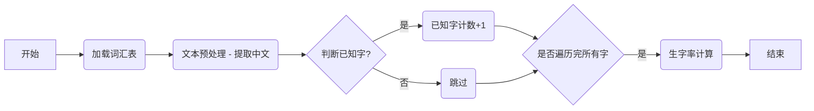

# 生字率计算

## 1. 概述

本文档详细描述了生字率计算的核心算法，包括数据准备、文本预处理、生字率计算逻辑和流程图。

## 2. 核心算法：生字率计算

1.  **数据准备**：
    *   **词汇表加载**:  从 `app/data/words.json` 文件中加载所有词汇数据到内存，构建一个 `words_dict` 和 `known_words_dict`。
    *    **`words_dict` 的结构**:
          * Key 是词 (word) 字符串。
          * Value 是一个  `WordModel` 对象。
   *   **`known_words_dict` 的结构**:
        *   Key 是字 (character)。
        *   Value 是一个集合 (set)， 包含该字在目标级别以下出现过的所有词性 (part of speech)。
        *   例如: `{"好": {"ADJ"}, "人": {"n"}, "学": {"v"}}`
        *   只加载 `chaotong_level` **小于**目标级别的词汇。

2.  **文本预处理**：
    *   **提取中文**: 使用正则表达式提取文本中的所有中文字符。
    *    **注意**:  **在 `# app/utils/literacy_calculator.py` 中，只关注字符级别的已知字判断，不涉及词性标注和分词逻辑。**

3.  **生字率计算逻辑**：
    *   **遍历文本中的每个字符**：遍历文本中的每个字符 (character)。
     *   **使用 `known_words_dict` 判断已知字**: 如果一个字 (character) 存在于 `known_words_dict` 的 keys 中， 并且 该字对应的词性 (part of speech)  也在  `known_words_dict` 的 value 中, 则认为该字是已知字。
     *    **如果一个字不在 `words.json` 中， 则认为是生字。**
    *   **生字计数**：统计文本中所有字的数量，以及已知字的个数。
    *   **生字率计算**：使用以下公式计算生字率和生字数量：
        *   **已知字率 = 已知字数 / 总字数**。 *其中，已知字数和总字数都不考虑去重，且不包含任何标点符号和非中文字符。*
        *   `生字率 = 1 - 已知字率`
        *   `生字数量 = 总字数 * 生字率`

### 3. 生字率检测流程图



### 4. 伪代码

```
function calculate_literacy_rate(text, target_level):
  known_words_dict = load_known_words(target_level)
  chinese_chars = extract_chinese_characters(text)
  total_chinese_words = length(chinese_chars)
  known_words_count = 0

  for each char in chinese_chars:
        if char in known_words_dict
            known_words_count = known_words_count + 1


  known_rate = known_words_count / total_chinese_words
  unknown_rate = 1 - known_rate
  return known_rate, unknown_rate
```

*   **`_load_known_words` 伪代码:**

    ```python
    def _load_known_words(words_json, target_level):
        # 1.  加载 words.json 文件
        # 2.  遍历 words_json 中的每一个词汇
        # 3.  如果词汇的 chaotong_level 小于 target_level
        # 4.  遍历词汇中的每一个字
        # 5.  将字作为 key, 词性加入到 set 中， 作为 value。
        # 6.  返回 key 为字，value 为词性 set 的字典， 例如：  {"好": {"ADJ"}, "人": {"n"}, "学": {"v"}}
        pass
    ```
*    **`_is_known_char` 伪代码:**

    ```python
     def _is_known_char(char, pos, known_words_dict):
         # 1.  如果 char 不在 known_words_dict 的 key 中， 返回 False
        # 2.  如果 pos 在 known_words_dict[char] 的 value (set) 中， 返回 True
        # 3.  否则， 返回 False
        pass
    ```
