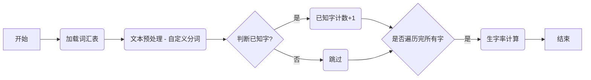

好的，接下来我将更新 `development_steps.md` 文件。 这个文件需要更新的内容较多，我会分步骤进行，并确保更新后的文档清晰易懂。

**首先，我将更新 `development_steps.md` 中关于核心逻辑与算法的部分，主要包括以下内容：**

1.  **添加从 `words.json` 获取 `word`, `pinyin`, `definition`, `example` 的说明。**
2.  **添加生字率计算时，如果字不在 `words.json` 中，则认为是生字的说明。**
3.  **添加使用 `jieba` 分词对 `words.json` 中没有的词汇进行词性标注的说明。**
4.  **详细描述多轮对话的状态机设计和状态转移逻辑。**
5.  **修改  `_load_known_words` 方法**:  使用 `words.json`  中 `characters` 字段的词性。

这是更新后的 `development_steps.md` 中 **核心逻辑与算法** 部分：

```markdown
## 3. 核心逻辑与算法

### 3.1 核心概念

1.  **字 (Character) 与 词 (Word)**：
    *   **字 (Character)**：汉字是中文的基本书写单位，例如 "我"、"你"、"好"。
    *   **词 (Word)**：词是由一个或多个汉字组成的具有完整语义的语言单位，例如 "你好"、"朋友"、"学习"。
    *   **明确区分**：在中文处理中，需要明确区分字和词的概念，因为它们在分词、词性标注以及生字率计算中扮演不同的角色。

2.  **词汇级别 (Vocabulary Level)**：
    *   **超童级别**：每个词汇都有一个对应的级别，例如 1 到 100，表示词汇的难度。
    *   **级别划分**：词汇级别可以基于 HSK 等标准，并进一步细分为 100 个超童级别。

3.  **生字率 (New Character Rate)**：
    *   **定义**：生字率指的是文本中 **不属于** 目标级别及其以下级别已知词汇的字的比例。
    *   **重要性**：生字率是衡量文本难度的一个关键指标，直接影响学习者的阅读体验和学习效果。

4.  **已知字 (Known Character) 和 生字 (New Character)**：
    *   **已知字**：在指定目标级别及其以下级别中，所有词汇包含的字，被认为是已知字。需要考虑词性，如果一个字在该词性下，出现在目标级别以下的词汇中，则认为是已知字。
    *   **生字**：在指定目标级别及其以下级别中，所有词汇不包含的字，被认为是生字。 需要考虑词性，如果一个字在该词性下，没有出现在目标级别以下的词汇中，则认为是生字。 **如果一个字不在 `words.json` 文件中，则认为是生字。**
    *   **词性影响**: 同一个字，如果在不同词性的词语中出现，如果词性的词语不在已知词汇中，那么这个字也属于生字。例如 “白” 字，在 “白色” 中是形容词，在“白说”中是动词，如果只知道“白色”，那么 “白说” 中的 “白” 属于生字。

### 3.2 核心算法：生字率计算

1.  **数据准备**：
    *   **词汇表加载**:  从 `app/data/words.json` 文件中加载所有词汇数据到内存，构建一个 `words_dict` 和 `known_words_dict`。
    *    **`words_dict` 的结构**:
          * Key 是词 (word) 字符串。
          * Value 是一个  `WordModel` 对象。
    *   **`known_words_dict` 的结构**:
        *   Key 是字 (character)。
        *   Value 是一个集合 (set)， 包含该字在目标级别以下出现过的所有词性 (part of speech)。
        *   例如: `{"好": {"ADJ"}, "人": {"n"}, "学": {"v"}}`
        *   只加载 `chaotong_level` 小于等于目标级别的词汇。

2.  **文本预处理**：
    *   **提取中文**: 使用正则表达式提取文本中的所有中文字符。
    *   **自定义分词**:  使用自定义的分词逻辑，将文本分割成词语和字， 使用最长匹配算法， 优先匹配更长的词语， 如果没有匹配到， 则使用 `jieba` 分词进行处理，并进行词性转换。
          *   自定义分词逻辑：
            *    加载  `words.json`  中的所有词汇， 构建 `words_dict`。
            *  按词汇的长度从长到短进行排序，优先匹配最长的词汇。
            *    遍历文本， 如果存在匹配的词汇，则将词汇和词性进行切分。 如果不存在匹配的词汇，则使用 `jieba` 分词，并添加词性转换后的词性和字到结果列表中。 **如果 `words.json` 中没有该词汇，则使用 jieba 的词性标注。**

3.  **生字率计算逻辑**：
    *   **遍历文本中的每个字符**：遍历文本中的每个字符 (character)，并获取其词性 (part of speech)。
     *   **使用 `known_words_dict` 判断已知字**: 如果一个字 (character) 存在于 `known_words_dict` 的 keys 中， 并且 该字对应的词性 (part of speech)  也在  `known_words_dict` 的 value 中, 或者在 `words.json` 中的 `characters` 字段的 `part_of_speech` 中，则认为该字是已知字。
    *   **生字计数**：统计文本中所有字的数量，以及已知字的个数。
    *   **生字率计算**：使用以下公式计算生字率和生字数量：
        *   **已知字率 = 已知字数 / 总字数**。 *其中，已知字数和总字数都不考虑去重，且不包含任何标点符号和非中文字符。*
        *   `生字率 = 1 - 已知字率`
        *   `生字数量 = 总字数 * 生字率`

### 3.3 生字率检测流程图



### 3.4 伪代码

```
function calculate_literacy_rate(text, target_level):
  known_words_dict = load_known_words(target_level)
  chinese_chars = extract_chinese_characters(text)
  total_chinese_words = length(chinese_chars)
  known_words_count = 0

  text_word_pos = custom_segment(text)

  for each char in chinese_chars:
     char_pos = get_char_and_pos(text_word_pos, char)
     if char_pos not None:
          char_in_text, pos_in_text = char_pos
          if char_in_text in known_words_dict and pos_in_text in known_words_dict[char_in_text]
                 known_words_count = known_words_count + 1
           else:
                for word_model in words:
                    if word_model.chaotong_level <= target_level and char_in_text == word_model.word:
                        for char_data in word_model.characters:
                            if char_data["character"] == char_in_text and char_data["part_of_speech"] in known_word_pos_dict[char_in_text] :
                                  known_words_count = known_words_count + 1
                                  break
                        if is_known:
                           break


  known_rate = known_words_count / total_chinese_words
  unknown_rate = 1 - known_rate
  return known_rate, unknown_rate
```

### 3.5 示例代码 (Python)

```python
import re
import jieba
import jieba.posseg

JIEBA_POS_MAP = {
            'n': 'n',      # 名词
            'v': 'v',      # 动词
            'a': 'a',      # 形容词
            'd': 'd',      # 副词
            'p': 'PREP',    # 介词
            'c': 'CONJ',    # 连词
            'u': 'PART',   # 助词
            'm': 'NUM',      # 数词
            'q': 'MW',     # 量词
            'r': 'PR',    # 代词
            'f': 'f',      # 方位词
            's': 's',     # 处所词
            't': 't',      # 时间词
            'l': 'OTHER',  # 临时语素, 转换为 '其他'
            'x': 'x',  # 标点符号
            'PER': 'PER', # 人名
            'LOC': 'LOC', # 地名
            'ORG': 'ORG', # 机构名
            'ADJ': 'ADJ',
            'ADV': 'ADV',
            "PR": "PR",
            "NUM": "NUM",
            "MW": "MW",
            "PREP": "PREP",
             "CONJ": "CONJ",
            "PART": "PART",
            'eng': 'OTHER',   # 英文，转换为 '其他'
        }

def map_jieba_pos(jieba_pos):
    """
    将 jieba 词性转换为 words.json 中的词性
    """
    return JIEBA_POS_MAP.get(jieba_pos, "OTHER") # 如果不存在，默认设置为 '其他'

def _custom_segment(self, text):
    """
    自定义分词函数
    Args:
        text: 待分词的文本字符串
    Returns:
        一个列表， 包含分词后的结果， 例如  [('你好', 'v'), ('，', 'x'), ('我', 'r'), ('喜欢', 'v'), ('跑步', 'n'), ('。', 'x')]
    """
    words = list(self.word_service.words.values())
    words.sort(key=lambda word: len(word.word), reverse=True) # 按词语长度进行排序，从长到短

    result = []
    start = 0
    while start < len(text):
        matched = False
        for word_model in words:
            if text.startswith(word_model.word, start):
                result.append((word_model.word, word_model.part_of_speech))
                start += len(word_model.word)
                matched = True
                break
        if not matched: # 如果没有匹配的词，则使用 jieba 分词，并转换词性
            jieba_words = jieba.cut(text[start:])
            for jieba_word in jieba_words:
                if jieba_word.strip(): # 过滤掉空格
                    jieba_pos = jieba.posseg.cut(jieba_word)
                    for word, flag in jieba_pos:
                       result.append((word, map_jieba_pos(flag)))
            start += len(text[start:])
            matched = True  #  使用 jieba 之后，跳出当前的循环

    return result

def _calculate_literacy_rate(self, text, target_level):
    """
    计算指定级别已知字率和生字率。

    Args:
        text: 待分析的文本字符串。
        target_level: 目标级别 (整数)。
    Returns:
        一个包含已知字率和生字率的元组 (known_rate, unknown_rate)。
    """
    known_word_pos_dict = self._load_known_words(target_level)
    chinese_chars = re.findall(r"[\u4e00-\u9fff]", text)
    total_chinese_words = len(chinese_chars)

    if total_chinese_words == 0:
        return (1, 0)

    known_words_count = 0

    # 使用自定义分词
    seg_list = self._custom_segment(text)
    text_word_pos = {}
    start = 0
    for word, flag in seg_list:
         for i in range(len(word)):
             text_word_pos[start] = (word[i], flag)
             start += 1

    for i in range(len(chinese_chars)):
       char = chinese_chars[i]
       char_pos = text_word_pos.get(i)
       if char_pos is not None:
           char_in_text, pos_in_text = char_pos
           is_known = False
           if char_in_text in known_word_pos_dict:
              if pos_in_text in known_word_pos_dict[char_in_text]:
                   is_known = True
              else:
                   for word_model in self.word_service.words.values():
                       if word_model.chaotong_level <= target_level and char_in_text == word_model.word:
                            for char_data in word_model.characters:
                                if char_data["character"] == char_in_text and char_data["part_of_speech"] in known_word_pos_dict[char_in_text] :
                                    is_known = True
                                    break
                            if is_known:
                               break

           if is_known:
            known_words_count += 1

    known_rate = known_words_count / total_chinese_words
    unknown_rate = 1 - known_rate
    return (known_rate, unknown_rate)

def _load_known_words(self, target_level):
    """
    加载小于等于目标级别的所有词汇。
    Args:
        target_level: 目标级别 (整数)。
    Returns:
        一个字典，key为字，value为词性集合(set), 例如 {"好": {"a", "ad"}, "人": {"n"}, "学": {"v"}}
    """
    known_words_dict = {}
    for word_model in self.word_service.words.values():
        if word_model.chaotong_level <= target_level:
            for char_data in word_model.characters:
                char = char_data["character"]
                part_of_speech = char_data["part_of_speech"]
                if char not in known_words_dict:
                   known_words_dict[char] = set()
                known_words_dict[char].add(part_of_speech)
    return known_words_dict

def load_jieba_userdict(self):
    """
    加载自定义词典
    """
    for word_model in self.word_service.words.values():
      jieba.add_word(word_model.word, tag=map_jieba_pos(word_model.part_of_speech) )


```
### 3.6 多轮对话策略

1.  **第一轮对话 (初始提示语)**:
    *   使用 **初始提示语模板**，提供故事场景、目标词汇级别、字数范围、目标生字率、重点词汇等基本要求，并明确 AI 的角色和目标。
    *  明确要求 AI 返回 JSON 格式数据， 包括 `title`，`content`，和 `key_words`。
    *   不包含 `new_char_rate` 和 `new_char` 的要求，这些将在后续的验证阶段计算。 提示 AI 生成故事时，注意 `new_char_rate` 和 `new_char`。

2.  **第二轮对话 (提供已知词汇)**:
    *   根据 `vocabulary_level` 加载已知词汇列表。
    *   如果已知词汇数量过多，可以选择分批次提供，或者只提供一定数量的示例。
    *   使用 **提供已知词汇模板**，将已知词汇列表添加到第二轮提示语中。
     *  在第二轮提示语中，如果重点词汇在已知词汇中， 可以适当调整重点词汇列表，确保故事包含一些新的挑战。

3.  **第三轮对话 (如果需要)**:
     *   **如果第二轮仍然提供太多的已知词汇， 可以进一步分割，分多轮提供**
     *  **根据第二轮的反馈**， 调整提示语， 例如：“请你注意，上轮提供的已知词汇不是所有都要使用， 只是供你参考。”

4.  **最终指令**:
    *   在最后一轮，给 AI 一个最终指令: `"请你根据以上需求，编写故事。"`
5.  **DeepSeek API 的使用**:
    *   **上下文管理**: 使用 `messages` 列表来管理对话上下文，在每轮对话后，将 AI 的回复添加到 `messages` 列表中。
    *   **调用 API**:  使用 `client.chat.completions.create` 函数调用 DeepSeek API。
6.  **故事验证**:
    *   在最后一轮对话后，使用我们之前的验证逻辑（包括生字率验证、重点词汇验证和字数验证）验证 AI 生成的故事。
7.  **JSON 写入**:
    *   如果验证通过， 构建符合规范的 JSON 响应， 添加 `new_char_rate` 和 `new_char`。
    *  **多轮对话的流程使用状态机进行管理， 根据用户的反馈动态调整对话策略**
    *  **状态机:**  使用一个简单的状态枚举来表示对话状态，例如 `INIT`, `PROVIDE_KNOWN_WORDS`, `FINAL_INSTRUCTION`， `FAILED`。

        *   **状态转移逻辑：**
            1.  **`INIT` 状态**: 发送初始提示语模板。
            2. **`INIT` -> `PROVIDE_KNOWN_WORDS`**: 初始状态，发送初始提示语后，进入 `PROVIDE_KNOWN_WORDS` 状态。
            3.  **`PROVIDE_KNOWN_WORDS` 状态**:  根据 `vocabulary_level` 加载已知词汇，并添加到提示语中。
            4. **`PROVIDE_KNOWN_WORDS` -> `FINAL_INSTRUCTION`**: 提供已知词汇后，进入 `FINAL_INSTRUCTION` 状态。
            5.  **`FINAL_INSTRUCTION` 状态**:  发送最终指令，并等待 AI 生成故事。
            6.  **`FINAL_INSTRUCTION` -> `INIT`**: 如果故事生成后验证失败，回到 `INIT` 状态，重新生成故事。
            7.  **`FINAL_INSTRUCTION` -> `FAILED`**: 如果故事生成后，达到最大重试次数，进入 `FAILED` 状态。
        *   **多轮对话控制:** 使用一个 `messages` 列表来管理对话的上下文，每次发送提示语时，将之前的对话历史也发送给 AI。
        *  **用户反馈调整：** 在 `FINAL_INSTRUCTION` 状态收到 AI 的回复后，进行故事验证， 如果验证不通过， 重新回到 `INIT` 状态，重新生成故事。


